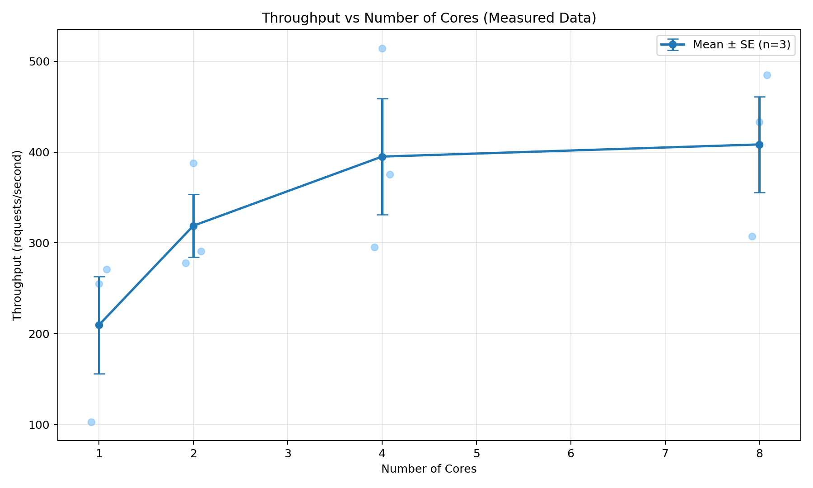
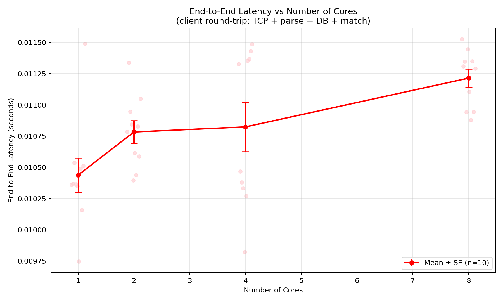

# ECE 568: HW4 Exchange Matching Server
Authors: Jingheng Huan, Vincent Choo

## Introduction
This project implements an exchange matching engine with account, symbol, order, query, and cancel support over a TCP/XML protocol. We evaluate scalability versus CPU core count and report both throughput and latency.

## Methodology
- Core configurations: `1, 2, 4, 8`
- For each core count: `3` iterations
- Each iteration:
  - Throughput test with `100` requests and `5` concurrent client threads
  - Latency test with `100` single-request round trips
- Workload mix: buy, sell, query, cancel operations on symbol `PERF`

Metrics:
- **Throughput**: requests/second
- **Latency**: average seconds/request

Graph convention:
- marker line: mean
- error bars: standard error (SE)
- scatter points: raw per-iteration values (`n=3`)

## Latest Results

Latest run summary:
- **1 core**: throughput `209.55 ± 53.59` req/s (SE), latency `0.003945 ± 0.000259` s (SE)
- **2 cores**: throughput `318.87 ± 34.65` req/s (SE), latency `0.004328 ± 0.000344` s (SE)
- **4 cores**: throughput `395.04 ± 64.05` req/s (SE), latency `0.003952 ± 0.000157` s (SE)
- **8 cores**: throughput `408.43 ± 52.77` req/s (SE), latency `0.004683 ± 0.000516` s (SE)

Interpretation:
- Throughput improves substantially from 1 to 4 cores.
- 8 cores still improves over 1 core, but variance is high.
- Latency remains in the same millisecond-scale range across configurations, with overlap in error bars.

## Concurrency Stability Update
After lock-contention fixes and deadlock-aware retries:
- Total operations: `6000`
- Successful operations: `5572` (`92.87%`)
- Business rejected operations (expected under randomized invalid requests): `428`
- System errors: `0`
- Protocol-correct responses (success + expected reject): `100.00%`

This indicates the system now reliably returns either a successful response or a valid business rejection, with no internal errors in the latest stress run.

## Engineering Changes That Improved Reliability
1. **DB-backed shared order book matching**  
   Matching now queries open orders from the shared database with price priority and FIFO tie-break, so all worker processes see a consistent global order book.

2. **Deadlock-aware retry with exponential backoff + jitter**  
   Transactional paths for order placement and cancel retry on PostgreSQL transient errors (`40P01`, `40001`), reducing failure probability under contention.

3. **Schema consistency guard**  
   Added a unique constraint on `(account_id, symbol_name)` in `positions` to prevent duplicate position rows under concurrent writes.

## Remaining Limitations
- Performance variance is still high at higher core counts because workload is short and database I/O dominates.
- With only `n=3` iterations per core count, confidence is limited; more runs would improve statistical certainty.

## Future Work
- Increase workload duration and request volume for more stable estimates.
- Add transaction-level observability (retry counters, lock-wait timing).
- Evaluate lock ordering and reduced flush pressure to lower contention further under heavier loads.
