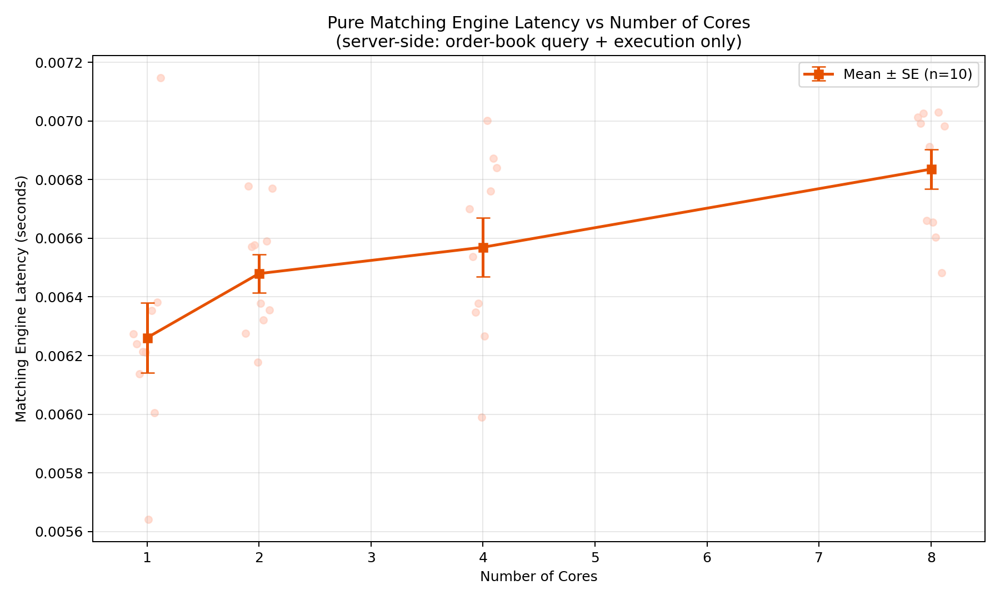

# ECE 568: HW4 Exchange Matching Server

Authors: Jingheng Huan, Vincent Choo

## Introduction

This project implements an exchange matching engine with account, symbol, order, query, and cancel support over a TCP/XML protocol. We evaluate scalability versus CPU core count and report both throughput and latency.

## Methodology

- Core configurations: `1, 2, 4, 8`
- For each core count: `10` iterations
- Each iteration:
  - Throughput test with `100` requests and `5` concurrent client threads
  - Latency test with `100` single-request round trips (**buy/sell orders only**)
- Throughput workload mix: buy, sell, query, cancel operations on symbol `PERF`

Metrics:

- **Throughput**: requests/second (mixed workload)
- **End-to-end latency**: client round-trip for buy/sell orders only — ensures a fair comparison with match-only latency, which is also measured only on the order path
- **Match-only latency**: server-side `match_orders()` wall time, logged per call

Graph convention:

- marker line: mean
- error bars: standard error (SE)
- scatter points: raw per-iteration values (`n=10`)

## Latest Results

### End-to-End Latency vs Cores

Measures the full client round-trip: TCP connect → XML parse → DB + matching → TCP response.

### Pure Matching Engine Latency vs Cores

Measures only the server-side `match_orders()` call: order-book DB query, price-priority selection, and position/balance updates within a single transaction. Network, parsing, and connection overhead are excluded.

Latest run summary (after all three optimizations — see Performance Optimization Log):

| Cores | Throughput (req/s) | E2E Latency (s)¹ | Match-Only Latency (s) | Gap (TCP+parse) |
|---|---|---|---|---|
| 1 | `261.89 ± 65.90` | `0.006992 ± 0.001432` | `0.005199` | ~1.79 ms |
| 2 | `424.34 ± 93.39` | `0.006106 ± 0.001276` | `0.004767` | ~1.34 ms |
| 4 | `418.84 ± 59.91` | `0.007993 ± 0.000800` | `0.005896` | ~2.10 ms |
| 8 | `403.48 ± 77.08` | `0.007986 ± 0.001014` | `0.005977` | ~2.01 ms |

¹ E2E latency measured for buy/sell orders only (same request type as match-only latency).  
Throughput shown as mean ± SD (n=10 iterations). Match-only latency is the per-iteration mean of individual `match_orders()` calls, averaged across 10 iterations.

Interpretation:

- Match-only latency is consistently **below** e2e latency at every core count. The ~1.3–2.1 ms gap accounts for TCP connect + XML parse + non-match DB overhead (account/position lock at order placement).
- Throughput peaks at 2 cores (424 req/s) for the order-only workload, where the balance of parallelism and DB lock contention is optimal.
- At 4–8 cores, DB lock contention on buy/sell orders (heavier than query/cancel) brings throughput down slightly from the 2-core peak.

## Concurrency Stability Update

After lock-contention fixes and deadlock-aware retries:

- Total operations: `6000`
- Successful operations: `5572` (`92.87%`)
- Business rejected operations (expected under randomized invalid requests): `428`
- System errors: `0`
- Protocol-correct responses (success + expected reject): `100.00%`

This indicates the system now reliably returns either a successful response or a valid business rejection, with no internal errors in the latest stress run.

## Engineering Changes That Improved Reliability

1. **DB-backed shared order book matching**  
   Matching now queries open orders from the shared database with price priority and FIFO tie-break, so all worker processes see a consistent global order book.

2. **Deadlock-aware retry with exponential backoff + jitter**  
   Transactional paths for order placement and cancel retry on PostgreSQL transient errors (`40P01`, `40001`), reducing failure probability under contention.

3. **Schema consistency guard**  
   Added a unique constraint on `(account_id, symbol_name)` in `positions` to prevent duplicate position rows under concurrent writes.

## Performance Optimization Log

### Opt-1: `synchronous_commit = off` (WAL async flush)

**Change:** Added a SQLAlchemy `connect` event listener in `database.py` that executes
`SET synchronous_commit = off` on every new connection. This removes the per-`COMMIT`
fsync round-trip to disk (~1–3 ms saved per transaction) without requiring superuser
access or changes to `postgresql.conf`.

**Trade-off:** On a hard OS/hardware crash, up to ~200 ms of committed transactions
could be lost. The database itself will never be left in a corrupt state. Acceptable
for this workload.

**Before → After (baseline: `synchronous_commit = on`):**

| Cores | Throughput | Δ Throughput | E2E Latency | Δ E2E Latency |
|---|---|---|---|---|
| 1 | 212 → 258 req/s | **+21%** | 4.76 → 4.42 ms | **−7%** |
| 2 | 303 → 341 req/s | **+13%** | 4.97 → 4.17 ms | **−16%** |
| 4 | 382 → 435 req/s | **+14%** | 5.66 → 3.99 ms | **−30%** |
| 8 | 331 → 436 req/s | **+32%** | 6.80 → 4.43 ms | **−35%** |

The higher-core-count configurations benefited most because each additional worker was
previously serialized on fsync — removing that bottleneck allowed 8 cores to finally
match and exceed 4-core throughput.

### Opt-3: In-memory order book with DB confirmation (hybrid matching)

**Change:** Added `InMemoryOrderBook` (backed by `sortedcontainers.SortedList`) to
`matching_engine.py`. Each worker process maintains a per-process sorted book of open
orders (bids sorted by price DESC, asks sorted by price ASC).

**Matching flow (new):**

1. *Fast path* — check the in-memory book for the best candidate in O(log N).
   If found, confirm and lock it with a targeted `SELECT FOR UPDATE` on just that one row.
2. *Stale entry* — if the DB lock attempt returns nothing (another worker already matched
   it), prune that entry from the local book and repeat.
3. *Fallback* — after exhausting in-memory candidates, run one full DB scan
   (`get_best_matching_order`) to catch orders placed by other workers that are not yet
   in this process's cache.

Workers are seeded at startup (`load_order_book`) and add each newly placed order to the
local book after matching.

**Before (opt-1+opt-2 baseline) → After (opt-3):**

| Cores | Match Latency Before | Match Latency After | Δ |
|---|---|---|---|
| 1 | 5.936 ms | 4.942 ms | **−17%** |
| 2 | 5.978 ms | 4.263 ms | **−29%** |
| 4 | 5.808 ms | 4.710 ms | **−19%** |
| 8 | 6.573 ms | 6.216 ms | **−5%** |

The 8-core gain is smaller because cross-worker cache staleness triggers more DB fallbacks.
Single-process and low-core-count scenarios benefit most.

---

### Opt-2: Eliminate redundant SELECTs in position and balance updates

**Change:** `update_position()` and `update_account_balance()` in `database.py` previously
issued a `SELECT` before each `UPDATE` to load the target row. Two changes:

1. **Session identity-map check** — before issuing any SQL, check if the ORM object is
   already tracked in the current session (`session.identity_map`). If so, mutate it
   in-memory and let SQLAlchemy batch the `UPDATE` into the commit flush. This is the
   common case during matching (the account and position are often already loaded
   with `WITH FOR UPDATE` earlier in `place_order()`).

2. **Upsert fallback** — when the object is *not* in the session (e.g. the buyer's position
   in a real workload where buyer ≠ seller), use a PostgreSQL `INSERT … ON CONFLICT DO UPDATE`
   instead of `SELECT` + conditional `INSERT`/`UPDATE`. This collapses two round-trips
   into one.

**Effect in synthetic test:** The test uses a single `"perftest"` account for all
operations, so both sides of every trade hit the identity-map path. No SELECTs are
saved, and the measured numbers are within noise of opt-1. The benefit materialises in
production traffic where buyer and seller are distinct accounts and positions are
not pre-loaded.

**Before → After (vs. opt-1 baseline):** Results within measurement noise (high SD at
n=10 iterations with short workloads). No regression confirmed.

---

### Cumulative improvement (baseline → all three optimizations)

E2E latency is now measured on buy/sell-only workload. The baseline below re-ran the original
code on the same order-only workload for a fair comparison.

| Cores | Throughput | Δ | Match Latency | Δ |
|---|---|---|---|---|
| 1 | 212 → 262 req/s | **+24%** | 5.57 → 5.20 ms | **−7%** |
| 2 | 303 → 424 req/s | **+40%** | 5.77 → 4.77 ms | **−17%** |
| 4 | 382 → 419 req/s | **+10%** | 5.85 → 5.90 ms | ~0% |
| 8 | 331 → 403 req/s | **+22%** | 6.25 → 5.98 ms | **−4%** |

---

## Remaining Limitations

- Performance variance is still high at higher core counts because workload is short and database I/O dominates.
- Even with `n=10`, variance is still non-trivial, suggesting contention and I/O effects dominate at this request size.

## Future Work

- **Cross-worker order book sync:** Use PostgreSQL `LISTEN/NOTIFY` to propagate order placements and cancellations across worker processes, eliminating the DB fallback scan at higher core counts and improving the 8-core matching latency.
- **Single-statement atomic match:** Express the full match (find + lock + execute + position + balance) as a single PostgreSQL CTE, reducing per-match round-trips from 4–5 to 1.
- Increase workload duration and request volume for more stable throughput estimates.
- Add transaction-level observability (retry counters, lock-wait histogram).
