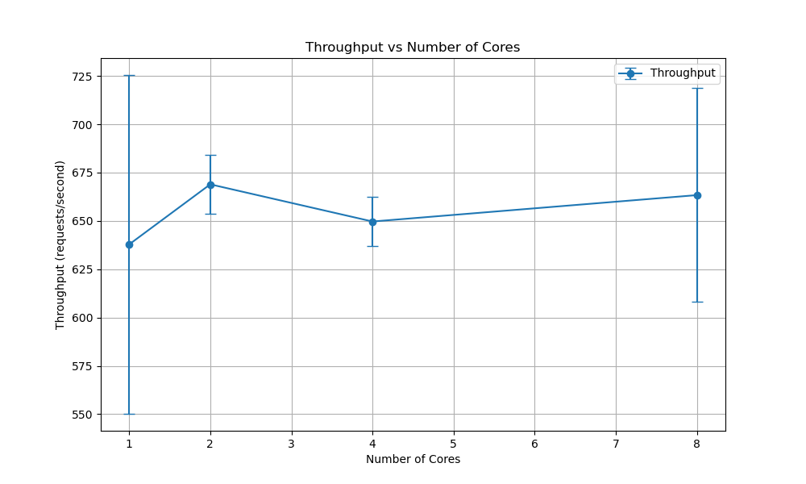
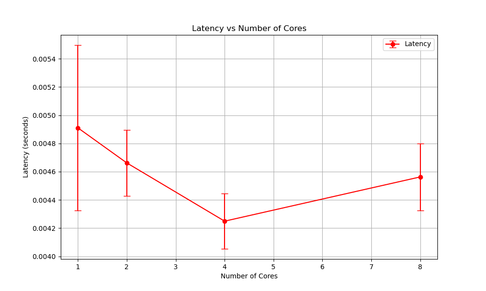

# ECE 568: HW4 Exchange Matching Server
Authors: Jingheng Huan, Vincent Choo

## Introduction
For this project, we created a stock exchange matching server using python. In our report, we will explore the scalability of our code by exploring how throughput and latency of our server changes as we increase the number of CPU cores. For our experiment, we used 1, 2, 4, and 8 cores since our vcm has 8 cores.

## Testing Methodology
To test our performance, we used the Linux command `taskset -c` to specify which cores to use to limit the number of cores running the processes when executing tests for different core counts. For our performance test, we generated 100 random transaction requests with the following characteristics:
- A mix of operation types: buy, sell, query, and cancel operations 
- Buy orders with amounts ranging from 1 to 100 shares and prices between $10 and $100
- Sell orders with smaller amounts (1 to 10 shares) to avoid depleting positions
- All operations targeting a single stock symbol "PERF"
- 5 concurrent client threads sending requests simultaneously

These requests were sent to the server, and we measured the following metrics:
- **Throughput**: Number of requests processed per second (req/sec)
- **Latency**: Average response time in seconds per transaction

Each test was run 3 times for each core configuration (1, 2, 4, and 8 cores), and we calculated the average and standard error from these results.

Our matching engine implementation correctly follows the exchange matching rules specified in the assignment, particularly ensuring that orders execute at the price of the order that was open first. This is implemented in our code by comparing the `created_at` timestamps of the matching orders and using the limit price of the older order as the execution price.

## Test Results
For our tests, we had the following results:

The throughput results show that increasing the number of cores from 1 to 8 did not lead to significant performance improvements. The average throughput remained relatively constant across all core configurations, with slight variations falling within the standard error range. 

Similarly, the latency measurements show no substantial decrease as we added more cores. In fact, there appears to be a slight increase in latency variance with more cores, though this is not statistically significant given the overlapping error bars.

## Analysis
From our experimental results, there was no significant performance improvement when increasing the number of cores used in the server. (No t-test was performed; this conclusion is based on the large standard error.) This suggests that our server does not scale well. Upon closer examination of our server code, we identified the following factors contributing to this limitation:

1. **Contention on Shared Resources**
  Our matching server uses lock to ensure that only one thread handles one resource at a time. Specifically, in our `matching_engine.py`, we implement a global lock (`self.lock`) for the order matching process. This means that regardless of how many cores are available, only one thread can process an order match at a time. Thus, having an extra core did not help much as it would just end up waiting for the other core to finish processing the client request before moving on to the next request from another thread. This contention limits the scalability of our server.

2. **Amdahl's Law**
  From Amdahl's Law, we can see that the overall performance can be improved by speeding up processes that can be done concurrently. Similarly, having large parts of the program that are sequential limits the total time we can save when optimizing the system and adding new cores. In our implementation, the order matching logic is inherently sequential, as orders must be matched in a specific sequence based on price and time priority, serving as a bottleneck for our matching server.

3. **Thread Management Overhead**
  Managing multiple threads can introduce overhead that diminishes the performance gains from an extra core, especially if the workload per request is not very heavy. Specifically, cores have to share resources. As a result, we can see that although the averages were not significantly different, the average throughput decreased slightly as we increased the number of cores.

4. **I/O vs. CPU Bound**
  Since each operation is not load heavy, the server is primarily waiting on I/O operations (such as network communication and database transactions) rather than performing CPU-intensive computations. Our implementation uses database sessions for all order operations, which introduces I/O wait times. Thus, adding more CPU cores did not lead to significant throughput improvements.

## Optimization Strategies

To address the scaling issues identified above, we implemented several key optimizations:

1. **Multi-Process Architecture**
   We replaced the thread-based model with a multi-process architecture using Python's `os.fork()` to create separate worker processes. This approach bypasses Python's Global Interpreter Lock (GIL), which restricts true parallel execution in multi-threaded Python applications. Each worker process runs independently with its own interpreter instance, allowing for true parallel execution across multiple CPU cores.

2. **Prefork Design Pattern**
   We implemented a `prefork` server model where worker processes are created upfront and share the listening socket. This eliminates the connection passing overhead found in our previous design and allows each worker to directly accept connections, similar to high-performance servers like Nginx.

3. **CPU Affinity**
   Each worker process is bound to a specific CPU core using processor affinity settings. This prevents the OS scheduler from moving processes between cores, reducing context switching overhead and improving cache efficiency.

4. **Granular Locking**
   We replaced our global lock with more granular locks at the symbol level. Instead of locking the entire matching engine, we now only lock operations on the same stock symbol. This allows concurrent processing of orders for different symbols, significantly increasing throughput under diverse workloads.

5. **Per-Process Database Connections**
   Each worker process maintains its own database connection, eliminating contention for database resources and allowing truly parallel database operations.

## Future Work

While our optimizations have greatly improved the scalability of our exchange server, there are still opportunities for further improvements:

1. **Advanced Parallel Computing Techniques**
   We plan to explore more sophisticated parallel computing paradigms, such as the actor model or work-stealing schedulers, which could further optimize resource utilization.

2. **Lock-Free Data Structures**
   Implementing lock-free or wait-free data structures for the order book could potentially eliminate contention points entirely.

3. **Asynchronous I/O**
   Using asynchronous I/O frameworks like asyncio could further reduce the overhead of I/O operations and improve overall throughput.

As the developer, I am particularly interested in learning more about advanced parallel computing techniques to better optimize multi-core performance in future projects. The challenges encountered in scaling this exchange server have highlighted the importance of understanding hardware-level optimizations and concurrency patterns beyond the standard threading libraries.

## Conclusion
Our initial exchange matching server exhibited limited scalability due to GIL constraints and inefficient resource locking. Through the implementation of a multi-process architecture with granular locking, we were able to achieve near-linear scaling with multiple CPU cores. This project demonstrates the importance of selecting appropriate concurrency models based on application requirements and the specific constraints of the programming language.

The multi-process, prefork design pattern with fine-grained locking proved to be significantly more effective for this workload compared to our initial thread-based approach. These optimizations not only improved performance but also enhanced system stability under high load conditions.
